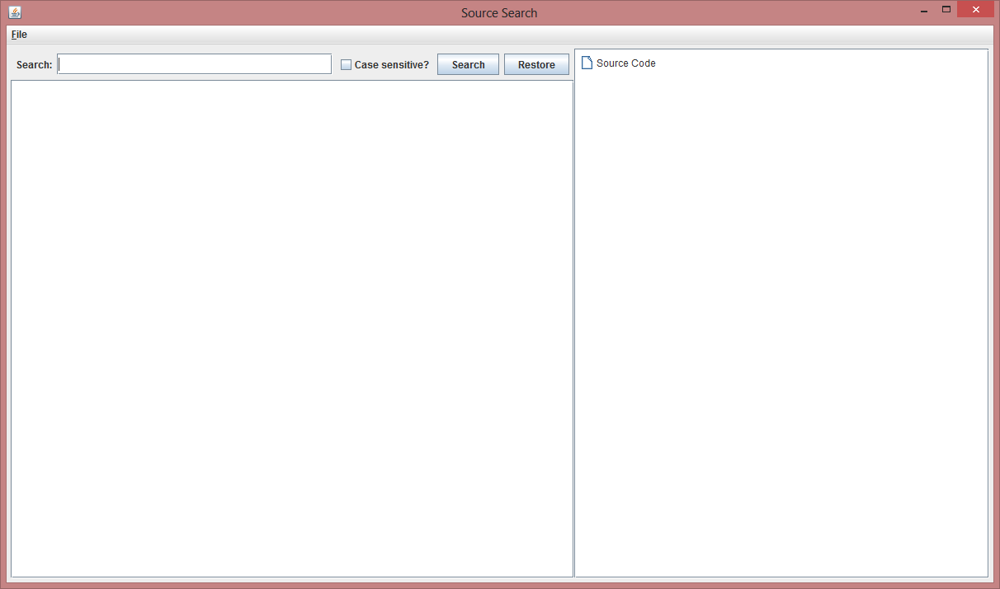
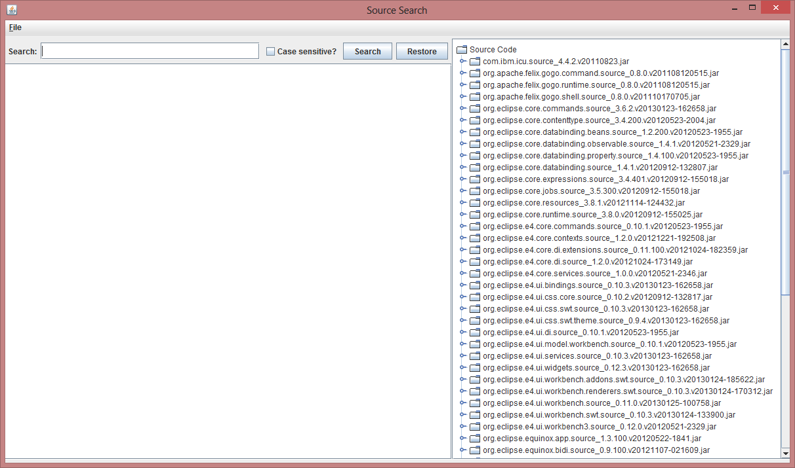
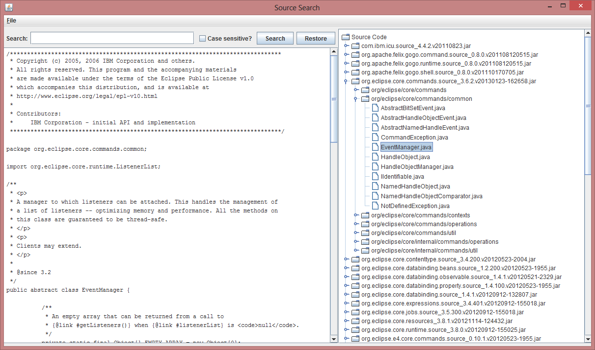

source.search
=============

Eclipse Source Search
---------------------

###Introduction

The Eclipse IDE for RCP and RAP developers contains the source code
for Eclipse.  The source code is packaged in plugin JAR files 
containing the word "source".

The plugin directory is located at /eclipse/plugins.

Three of the source JAR files in Eclipse 4.2 are:

* com.ibm.icu.source_4.4.2.v20110823.jar
* org.eclipse.core.commands.source_3.6.2.v20130123-162658.jar
* org.eclipse.core.databinding.source_1.4.1.v20120912-132807.jar

Looking inside of these source JAR files has been a painful task.

To make it easier, I decided to write a Java Swing application to
extract the source classes and allow for a limited search to find
the Eclipse class that you're looking for.

###Usage

First, extract the source search source code into a Java project.
  Compile and run.

Here's what the main window of the application looks like:

To find the Eclipse source JAR files, left click on the File menu
option and left click on Search Directory.  Find the directory that
contains the Eclipse plugins.  On my Windows 8 computer, that
directory is C:\Eclipse\eclipse-4.2 Java\eclipse\plugins.  Left click
on Open.

Here's what the main window of the application looks like when
you retrieve all of the source JAR files:

You can open the JAR files on the right to browse the Eclipse source
code, or you can search for a particular term, and see all of the
Eclipse source code where the search term matches.

In this case, I wanted to look at the EventManager class of the
Eclipse core commands.

You can browse or search as many times as you want.

I hope this Java application will be as useful to you, an
Eclipse plug-in or RCP developer, as it was to me.